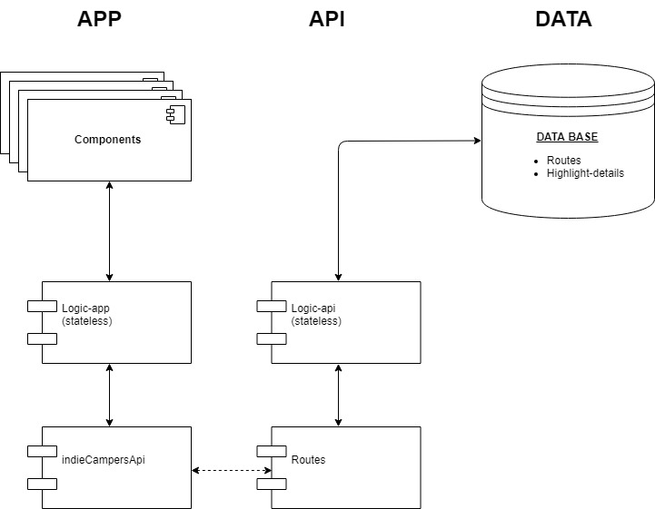

# Structure

I would divide the web app in 3 main layers; APP, API and DATA.

The APP, is divided in 3 modules (components, logic-app, indieCampersApi). The components just renders and interacts with the user. The needed components would be:
- The start and end location inputs component
- The route list component (I would suggest render the routs in a map)
- The highlight details component
- The feedback component.

The information gathered by the components is sent to the logic-app. There, it's analyzed and sent to indieCampersApi. In this last module, the information is fetched to the API.

The API would have 2 modules (routes and logic-api). The routes would receive the asked routes to the API and would send the information to the logic-api. The logic-api would have imported the DATA modules.

The DATA contains the schemas. A schema defines how the data base is created. For this web app, I would create the schema Routes with:
- Id
- Starting
- Ending
- Highlights: array of objects with an id, lat, lng, title,(maybe a picture) ....

To do not send to much data and slow down all the procedure, in the highlight I would send only small information. Therefore I would create another schema with the details of each highlight. Higlights-Details schema would be:
- Id
- Location
- Title
- Picture
- Description
- Price
- Link (for more info)
- ...

# Flows

## First-flow: *From start and end location to list of rutes*

First the user would see the inputs component. There the user selects the starting and the end locations of his/her route. The components send the information (in async await function) to the stateless logic-app module

In this module the logic checks if the inputs are fulfilled, are different one each other etc... In the case that one of the inputs would be empty, it would throw an error. And with the implemented handling errors, the user would see the feedback component asking him to fulfill the empty input. This logic would be tested to ensure all the possible cases are covered.

If the information is good, is sent to indieCampersAPI. In this layer, the information is fetched in a GET route. The starting and end location would be written in the URL of the request. This information goes to the next main layer: The API.

In the API layer, the route module receives the GET request and it parses the information from the URL. Once we have the start and end points, the route sends the locations to the logic-api. In the logic-api layer the data models are exported from layer DATA. In this module the logic searches from our database which routes contain the starting and the ending locations (indifferently if it is start or end since we could travel in both ways). This logic would check also anomalies in the search, like if there is not any route. In this case it would throw an error. In the case it found matched routes, the logic would return them in an array. This information goes back to the route module. And there is sent in JSON to the APP layer that was waiting in a promise.

In the App layer de JSON is parsed in the module indieCampersApi, returned to the app-logic and rendered by the route list component.

## Second Flow: *From selecting route to highlights detail*

In the route list component, the user would select the convenient route. The route is an object with the highlights in an array and each highlight has an id. Therefore, I would send the array of highlights id from the selected route to the logic-app (also, in an async await function)

In the logic-app I would map the array and for each id I would send it to the indieCampersApi. There, each id would be fetched in a GET request with the id in the URL. This would create an array of promises.

As the same way we got the routes, we would get the details of each highlight. In the API layer, the id is received by the API throught the URL. It goes to the logic-api and the logic finds the details by its id through the DATA.
The details are returned to the APP layer as the same way of the first flow.

In the APP layer, there was an array of promises waiting to be resolved. I would write the Promise.all() method and, once we have all the details I would render them in the highlight details components. In there, the user can finnally see the amazing route he have chosen to ride Indie Camper's van.

