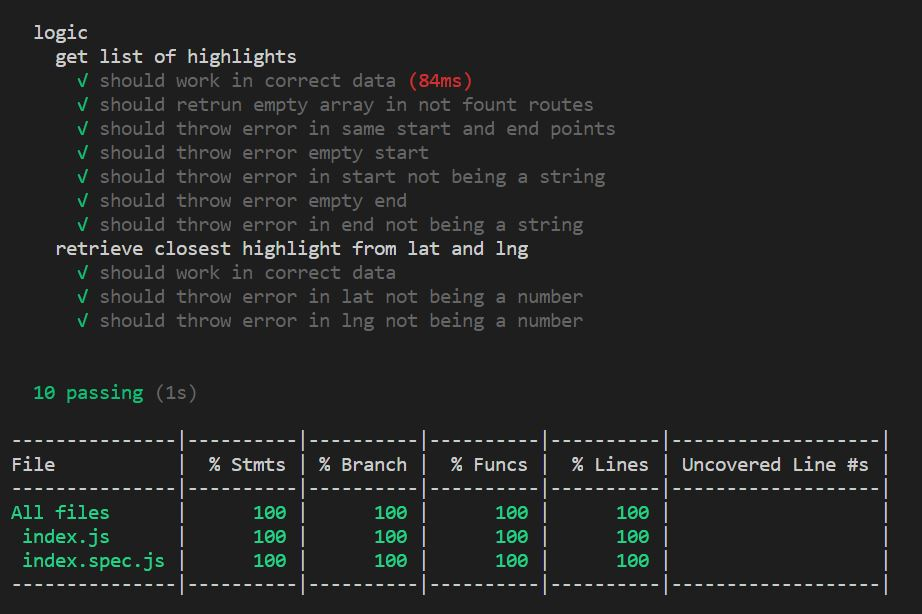

# Phase 2

## Introduction

Using any technology you want and the answer you gave on phase 1, implement an API (json) that receives the startingPoint and the EndPoint and returns a list of highlights.
For bonus points you could develop an endpoint that receives any lat long and returns the closest highlight.

## Examples of use

### get list of highlights
GET: http://localhost:8000/api/list/?start=Barcelona&end=Lisbon

### get closest highlight
GET: http://localhost:8000/api/closest/?lat=38.724697&lng=-9.140790

## Testing-coverage

## Technologies used

